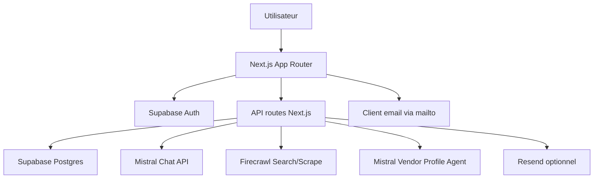

# Architecture Systeme

## Vue D'Ensemble

## Modules Principaux

### App

- `app/page.tsx`: accueil public, routage email vers login/signup, Google OAuth
- `app/onboarding/page.tsx`: collecte profil mariage
- `app/chat/page.tsx`: interface conversationnelle Hada
- `app/monmariage/page.tsx`: consultation et edition du profil
- `app/vendors/page.tsx`: selection par categorie
- `app/venues/page.tsx`: vue dediee lieux
- `app/vendors/[slug]/page.tsx` et `app/venues/[slug]/page.tsx`: fiches detail

### API

- `app/api/profile/route.ts`: profil mariage
- `app/api/chat/route.ts`: conversation, intention, recherche, mise a jour profil
- `app/api/vendors/route.ts`: lecture des candidats
- `app/api/vendors/contact/route.ts`: brouillon de contact
- `app/api/survey/route.ts`: survey et notification optionnelle
- `app/api/auth/*`: helpers inscription, check email, logout

### Services Metier

- `lib/server/hada.ts`: conversation, recherche, quota, cache, contact
- `lib/server/firecrawl.ts`: recherche web, scraping, rotation de cles Firecrawl
- `lib/server/vendor-profile-normalizer.ts`: normalisation Mistral des fiches prestataires
- `lib/vendor-catalog.ts`: catalogue fallback et categories supportees
- `lib/prompts.ts`: prompts planner et annonces recherche

## Flux Chat Et Recherche

1. Le client envoie un message a `POST /api/chat`.
2. La route valide le bearer token Supabase.
3. Hada charge le profil, la conversation et le contexte recent.
4. Mistral determine l'intention: conseil, recherche, mise a jour profil, contact ou smalltalk.
5. Si une recherche est prete, Hada cree un `vendor_request`.
6. Hada tente d'abord Firecrawl en mode strict, puis en mode elargi.
7. Si aucun resultat web exploitable n'est trouve et qu'aucune cle Firecrawl n'est configuree, le catalogue local peut servir de fallback.
8. Les candidats sont normalises par le Vendor Profile Agent Mistral.
9. Les candidats exploitables sont inseres dans `vendor_candidates`.
10. Le chat retourne un CTA vers `/vendors`.

La beta limite les recherches a 2 par fenetre de 48h par utilisateur.

## Contact Prestataire

Le contact actuel est assiste, pas automatise:

1. Hada prepare un sujet et un corps d'email.
2. L'app ouvre le client email de l'utilisateur avec `mailto:`.
3. Le brouillon est journalise dans `outreach_threads` et `outreach_messages`.

Il n'y a pas encore d'envoi email serveur vers les prestataires.

## Survey

Le popup survey s'ouvre apres sortie d'une fiche prestataire. Il collecte:

- note de recommandation
- points apprecies
- frustrations
- intention de reutilisation
- feature revee
- sensibilite prix
- modele de paiement prefere

Les reponses sont stockees en base. Un email interne est envoye seulement si Resend est configure.

## Garde-Fous

- Auth obligatoire sur les pages et routes privees.
- Validation serveur du token Supabase avant acces aux donnees.
- Pas de contact prestataire sans action explicite de l'utilisateur.
- Pas d'invention volontaire de prix, disponibilites, avis ou coordonnees.
- Fiches prestataires filtrees si elles sont trop generiques ou trop pauvres.
- Fallback Google externe quand la recherche web n'aboutit pas.
