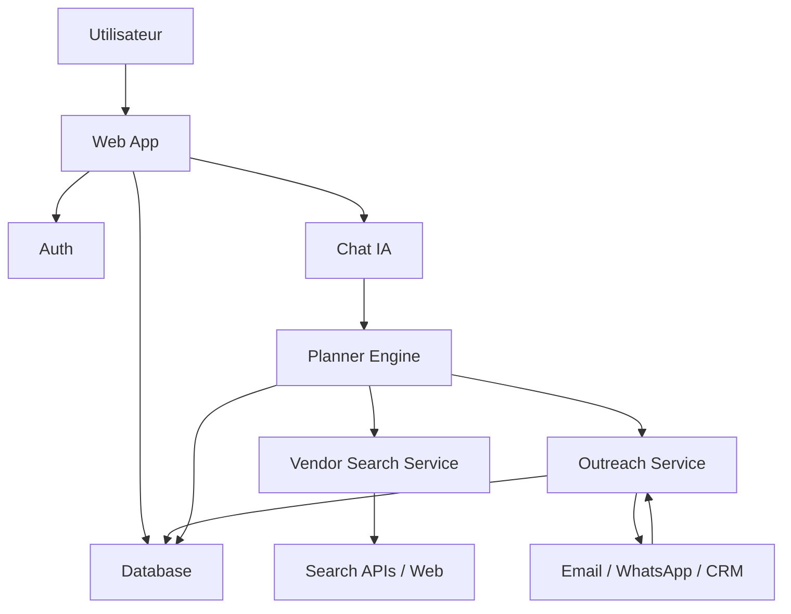

# System Architecture

## Vue d'ensemble

## Parcours technique

### 1. Authentification

- inscription / connexion
- creation du `user`
- creation d'un `wedding_profile` initial

### 2. Onboarding

- formulaire multi-etapes
- persistance progressive
- score de completion du profil

### 3. Chat IA

- chargement du resume du profil
- injection du contexte dans le prompt systeme
- memoire conversationnelle stockee
- prise de decision par outils

### 4. Qualification du besoin

L'agent detecte:

- type de prestataire
- champs deja connus via le profil
- informations manquantes
- niveau de confiance pour lancer la recherche

### 5. Recherche

Pipeline conseille:

1. construire une requete structurée
2. lancer une recherche web ou interroger une base de vendors
3. normaliser les resultats
4. scorer les prestataires
5. retourner les 5 meilleurs avec justification

### 6. Outreach

- generation d'un message base sur le contexte utilisateur
- validation utilisateur obligatoire
- envoi vers le prestataire
- stockage du thread
- ingestion des reponses

## Services metier recommandes

### Planner Engine

Responsable de:

- lire le profil utilisateur
- comprendre l'intention
- poser les bonnes questions
- decider quand lancer les outils

### Vendor Search

Responsable de:

- gerer les schemas de recherche par categorie
- agregger les resultats externes
- dedoublonner
- scorer

### Outreach

Responsable de:

- generer les messages
- executer l'envoi
- suivre les statuts
- recuperer les reponses

## Outils IA a exposer

- `get_wedding_profile`
- `update_wedding_profile`
- `start_vendor_intake`
- `search_vendors`
- `save_vendor_candidates`
- `draft_contact_message`
- `send_contact_message`
- `sync_vendor_replies`

## Garde-fous IA

- ne jamais contacter un prestataire sans validation explicite
- ne pas inventer de disponibilites ou de prix
- citer les donnees connues vs supposees
- journaliser toutes les actions tools
- prevoir des prompts differents pour qualification, recherche et outreach
